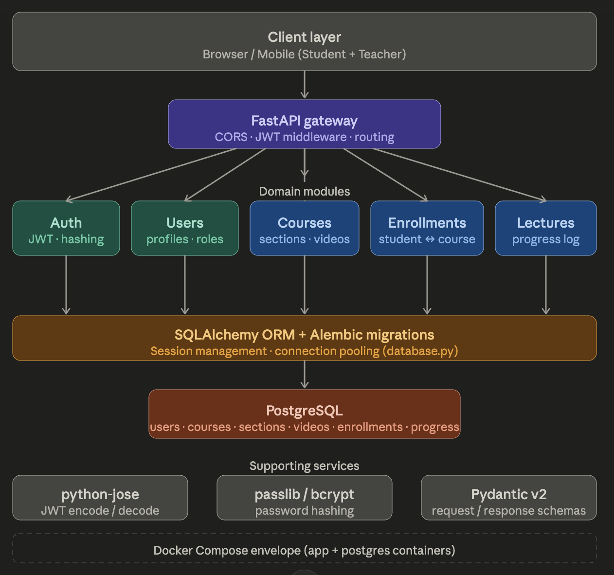
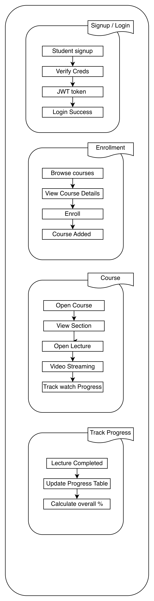
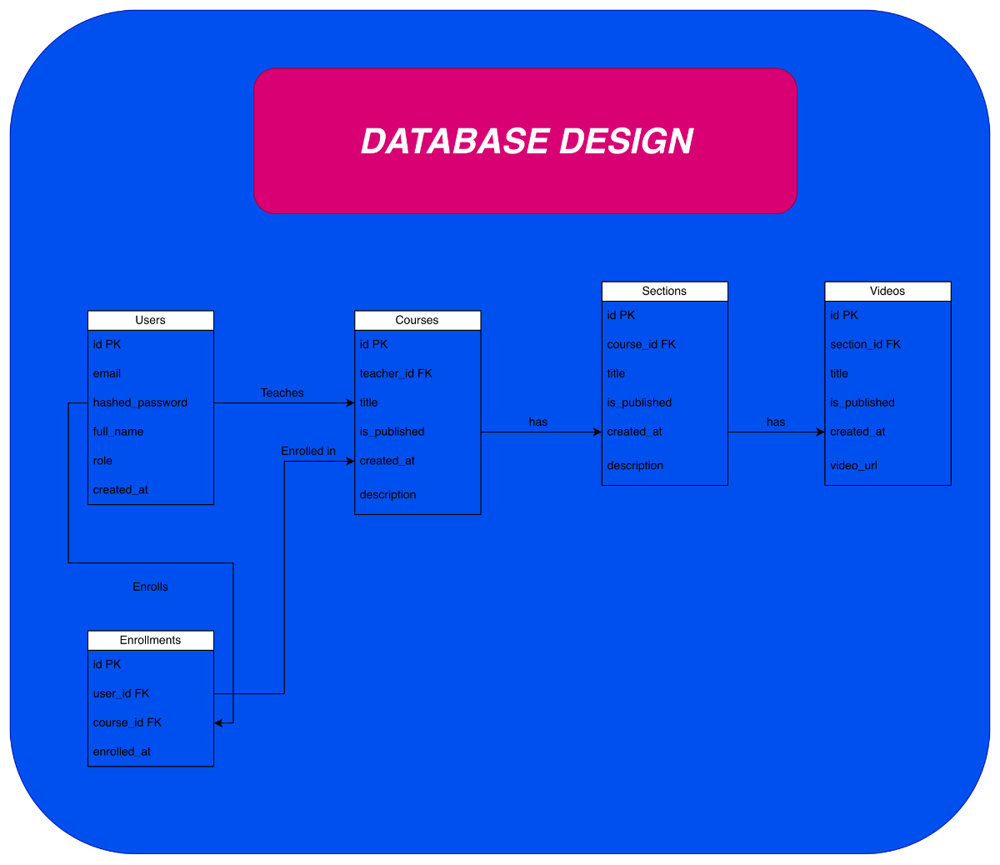

# LMS — Learning Management System

A backend REST API for a Learning Management System built with **FastAPI**, **PostgreSQL**, and **SQLAlchemy (async)**. The system supports two types of users — students and teachers — with full course, section, video, enrollment, and progress tracking capabilities.

---

## Table of Contents
- [Project Overview](#project-overview)
- [Architecture](#architecture)
- [User Types](#user-types)
- [User Flows](#user-flows)
- [API Reference](#api-reference)
- [Database Design](#database-design)
- [Project Structure](#project-structure)
- [Getting Started](#getting-started)
- [Changelog](#changelog)

---

## Project Overview

LMS API is a monolithic REST backend that powers a learning platform where:
- **Teachers** can create courses, organize them into sections, and upload video lectures
- **Students** can browse courses, enroll, watch lectures, and track their progress

The API is built with a clean layered architecture — router → service → repository — with centralized logging, error handling, and retry logic shared across all modules.

**Tech Stack:**
- Python 3.12
- FastAPI 0.115
- PostgreSQL 16
- SQLAlchemy 2.0 (async)
- Alembic (migrations)
- JWT (python-jose)
- bcrypt / passlib (password hashing)
- structlog (structured logging)
- tenacity (retry logic)
- Pydantic v2

---

## Architecture

### Architectural Pattern
This project follows a **Monolithic Architecture** — all modules (users, courses, sections, videos, enrollments, progress) live in a single deployable FastAPI application. This is intentional for an MVP — simpler to develop, deploy, and debug.

### High Level Architecture


### System Architecture


---

## User Types

| Role | Description |
|------|-------------|
| `student` | Can browse, enroll in courses, and watch lectures |
| `teacher` | Can create and manage courses, sections, and videos |

---

## User Flows

### Student Flow


1. Register with role `student`
2. Login → receive access token + refresh token
3. Browse and search published courses
4. View course detail (sections and video list)
5. Enroll in a course
6. Watch videos (only accessible after enrollment)
7. Mark videos as complete and track progress

### Teacher Flow


1. Register with role `teacher`
2. Login → receive access token + refresh token
3. Create a new course (starts as draft)
4. Add sections to the course
5. Add videos to each section
6. Publish the course (makes it visible to students)
7. Manage and update course content

---

## API Reference

### Base URL
```
http://localhost:8000
```

### Authentication
All protected routes require a Bearer token in the Authorization header:
```
Authorization: Bearer <access_token>
```

### Users Module

| Method | Endpoint | Auth | Description | Status |
|--------|----------|------|-------------|--------|
| POST | `/users/register` | No | Register a new user (student or teacher) | Done |
| POST | `/users/login` | No | Login and receive access + refresh tokens | Done |
| POST | `/users/logout` | No | Revoke refresh token | Done |
| POST | `/users/refresh` | No | Get new access token using refresh token | Done |
| GET | `/users/me` | Yes | Get current user profile | Done |
| PUT | `/users/me` | Yes | Update profile (name, avatar) | Done |
| PUT | `/users/me/password` | Yes | Change password | Pending |

### Courses Module

| Method | Endpoint | Auth | Description | Status |
|--------|----------|------|-------------|--------|
| GET | `/courses` | No | List and search published courses | Pending |
| GET | `/courses/{id}` | No | Get course detail with sections | Pending |
| POST | `/courses` | Teacher | Create a new course | Done |
| PUT | `/courses/{id}` | Teacher | Update course (including publish) | Done |
| DELETE | `/courses/{id}` | Teacher | Delete course | Pending |
| GET | `/courses/me` | Teacher | Get teacher's own courses | Done |

### Sections Module

| Method | Endpoint | Auth | Description | Status |
|--------|----------|------|-------------|--------|
| POST | `/courses/{id}/sections` | Teacher | Add section to course | Pending |
| PUT | `/courses/{id}/sections/{sid}` | Teacher | Update section | Pending |
| DELETE | `/courses/{id}/sections/{sid}` | Teacher | Delete section | Pending |

### Videos Module

| Method | Endpoint | Auth | Description | Status |
|--------|----------|------|-------------|--------|
| POST | `/courses/{id}/sections/{sid}/videos` | Teacher | Add video to section | Pending |
| GET | `/courses/{id}/sections/{sid}/videos/{vid}` | Student | Get video (enrolled only) | Pending |
| PUT | `/courses/{id}/sections/{sid}/videos/{vid}` | Teacher | Update video | Pending |
| DELETE | `/courses/{id}/sections/{sid}/videos/{vid}` | Teacher | Delete video | Pending |

### Enrollments Module

| Method | Endpoint | Auth | Description | Status |
|--------|----------|------|-------------|--------|
| POST | `/enrollments` | Student | Enroll in a course | Pending |
| GET | `/enrollments/me` | Student | Get my enrolled courses | Pending |
| DELETE | `/enrollments/{course_id}` | Student | Unenroll from course | Pending |

### Progress Module

| Method | Endpoint | Auth | Description | Status |
|--------|----------|------|-------------|--------|
| POST | `/progress` | Student | Mark video as complete | Pending |
| GET | `/progress/{course_id}` | Student | Get progress for a course | Pending |

---

## Database Design



### Tables

| Table | Description |
|-------|-------------|
| `users` | Stores all users (students and teachers) with role field |
| `refresh_tokens` | Stores hashed refresh tokens per user, supports revocation |
| `courses` | Course records owned by a teacher |
| `sections` | Sections within a course, ordered by `order_index` |
| `videos` | Video lectures within a section, ordered by `order_index` |
| `enrollments` | Student-course enrollment records |
| `video_progress` | Per-video completion tracking per student |

---

## Project Structure

```
lms-api/
├── alembic/                    # Database migrations
│   ├── versions/               # Migration files (commit these)
│   ├── env.py
│   └── script.py.mako
├── src/
│   ├── core/                   # Shared cross-cutting concerns
│   │   ├── errors/
│   │   │   ├── codes.py        # All error codes (AUTH_001, USR_001 etc.)
│   │   │   ├── exceptions.py   # AppException base class
│   │   │   └── handlers.py     # FastAPI exception handler registration
│   │   ├── retry/
│   │   │   ├── decorator.py    # @with_retry decorator
│   │   │   └── strategies.py   # fixed, exponential, jitter backoff
│   │   ├── logger.py           # structlog setup + request logging middleware
│   │   └── security.py         # hash_password, verify_password
│   ├── users/                  # Users + Auth domain
│   │   ├── models.py           # User + RefreshToken ORM models
│   │   ├── schemas.py          # Pydantic request/response models
│   │   ├── repository.py       # All DB queries
│   │   ├── service.py          # Business logic
│   │   └── router.py           # API routes
│   ├── courses/                # Courses domain
│   │   ├── models.py           # Course ORM model
│   │   ├── schemas.py          # Pydantic request/response models
│   │   ├── repository.py       # All DB queries
│   │   ├── service.py          # Business logic
│   │   └── router.py           # API routes
│   ├── config.py               # Pydantic Settings (reads .env)
│   ├── database.py             # Async engine + get_db dependency
│   └── main.py                 # App factory
├── tests/
│   ├── users/
│   └── conftest.py
├── public/                     # Architecture diagrams
├── docker/
│   ├── Dockerfile
│   └── docker-compose.yml
├── alembic.ini
├── requirements.txt
├── .env.example
└── README.md
```

---

## Getting Started

### Prerequisites
- Python 3.12
- PostgreSQL 15+
- pyenv (recommended)

### Installation

```bash
# 1. Clone the repo
git clone <repo-url>
cd lms-api

# 2. Create and activate venv
python -m venv venv
source venv/bin/activate

# 3. Install dependencies
pip install -r requirements.txt

# 4. Setup environment
cp .env.example .env
# Edit .env with your DB credentials and JWT secret

# 5. Run migrations
alembic revision --autogenerate -m "initial"
alembic upgrade head

# 6. Start the server
venv/bin/uvicorn src.main:app --reload
```

API docs available at: `http://localhost:8000/docs`

### Environment Variables

| Variable | Required | Default | Description |
|----------|----------|---------|-------------|
| `DATABASE_URL` | Yes | — | PostgreSQL connection string |
| `JWT_SECRET_KEY` | Yes | — | Secret key for signing JWTs (min 32 chars) |
| `JWT_ALGORITHM` | No | `HS256` | JWT signing algorithm |
| `JWT_ACCESS_TOKEN_EXPIRE_MINUTES` | No | `30` | Access token expiry in minutes |
| `JWT_REFRESH_TOKEN_EXPIRE_DAYS` | No | `7` | Refresh token expiry in days |
| `APP_ENV` | No | `development` | Environment (development/production) |
| `LOG_LEVEL` | No | `INFO` | Log level |
| `LOG_FORMAT` | No | `console` | Log format (console/json) |

---

## Error Response Format

All errors return a consistent shape:

```json
{
    "error_code": "AUTH_001",
    "detail": "Invalid email or password."
}
```

### Error Code Reference

| Code | Status | Description |
|------|--------|-------------|
| `AUTH_001` | 401 | Invalid email or password |
| `AUTH_002` | 401 | Access token expired |
| `AUTH_003` | 401 | Access token invalid |
| `AUTH_004` | 401 | Refresh token invalid or revoked |
| `AUTH_005` | 403 | Insufficient role |
| `AUTH_006` | 409 | Email already exists |
| `USR_001` | 404 | User not found |
| `USR_002` | 401 | User account inactive |
| `USR_003` | 400 | Current password incorrect |
| `CRS_001` | 404 | Course not found |
| `CRS_002` | 400 | Course not published |
| `CRS_003` | 403 | Not the owner of the course |
| `GEN_001` | 500 | Internal server error |
| `GEN_002` | 422 | Validation error |

---

## Changelog

### [0.2.0] — 2026-05-29 — Courses Phase (Partial)

#### Added
- `POST /courses` — Create a new course as a teacher. Course starts as draft (is_published: false). Requires teacher role.
- `GET /courses/me` — Get all courses belonging to the logged in teacher. Returns list with total count. Includes both draft and published courses.
- `PUT /courses/{id}` — Update course fields (title, description, thumbnail_url, is_published). Partial update supported. Validates that the requesting teacher is the owner of the course. Used to publish a course by setting is_published to true.
- `Course` ORM model with Alembic migration.
- Ownership check pattern in service layer — teacher can only update or delete their own courses.
- `CRS_001`, `CRS_002`, `CRS_003` error codes added to centralized error registry.

---

### [0.1.0] — 2026-05-28 — Users Phase

#### Added
- `POST /users/register` — Register a new student or teacher account. Validates email, password (min 8 chars), and role. Returns user object on success.
- `POST /users/login` — Authenticate with email and password. Returns a signed JWT access token (30 min expiry) and a refresh token (7 day expiry). Revokes all previous refresh tokens on each login.
- `POST /users/logout` — Revoke the current refresh token. Subsequent refresh attempts with the same token return 401.
- `POST /users/refresh` — Exchange a valid refresh token for a new access token. Refresh token is reused until logout or expiry.
- `GET /users/me` — Returns current logged in user profile. Requires Bearer token. Uses get_current_user dependency to verify JWT and fetch user from DB.
- `PUT /users/me` — Update profile fields (full_name, avatar_url). Partial update supported — only fields provided are updated.
- `get_current_user` dependency — Extracts and validates JWT from Authorization header, fetches user from DB. Used by all protected routes.
- `require_teacher` dependency — Wraps get_current_user, enforces teacher role. Used by all course management routes.
- `require_student` dependency — Wraps get_current_user, enforces student role. Used by enrollment and progress routes.
- Centralized error handling via AppException with consistent error_code + detail response shape.
- Centralized structured logging via structlog with per-request request_id binding.
- Centralized retry logic via tenacity with exponential jitter backoff for transient DB errors.
- User and RefreshToken ORM models with Alembic migration.
- bcrypt password hashing via passlib in core/security.py.